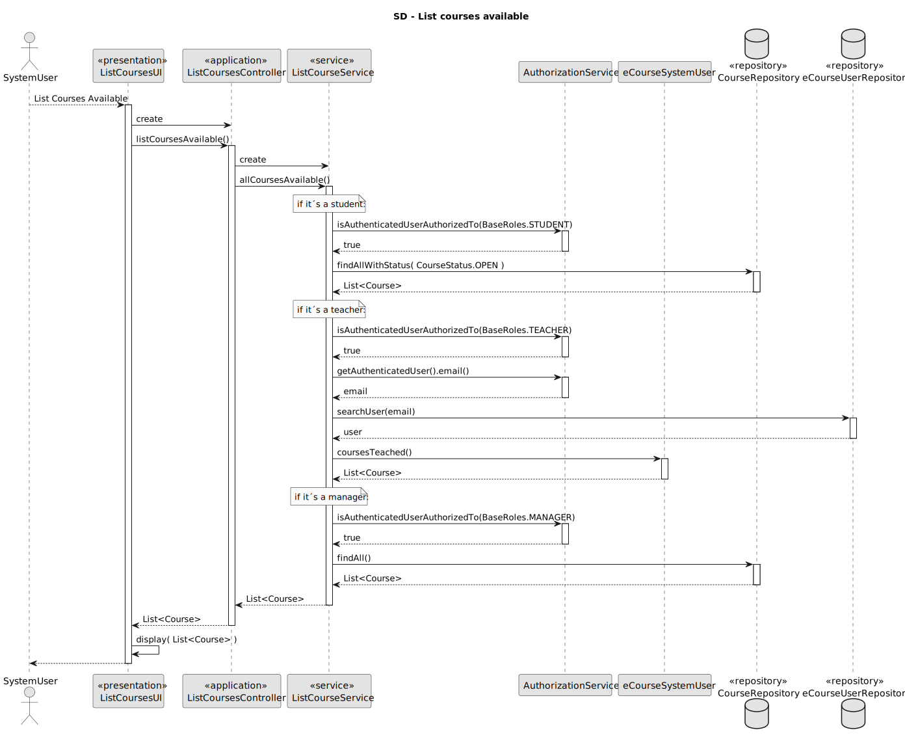
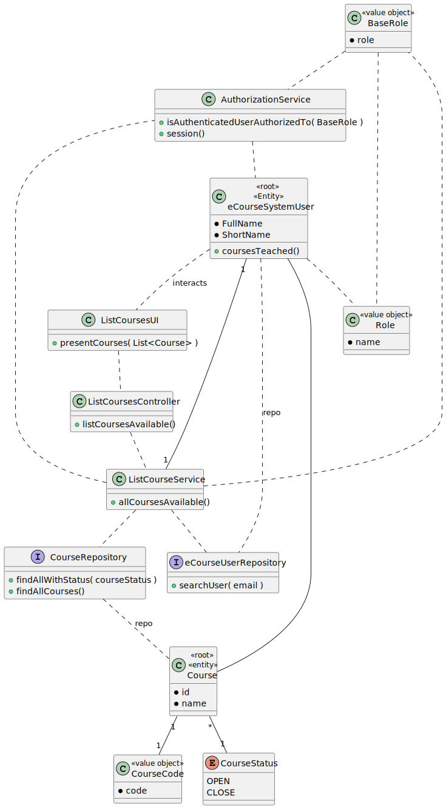

# US 1006

As User, I want to list all the courses that are available to me

## 1. Context

It is the first time this tasked is assigned to be developed.

>### **Client Forum:**

>**Question:** Relative to this US, what should we list according to the User role?
>
> - Student: Courses that Student is enrolled
>
> - Teacher: Courses that Teacher teaches
>
> - Manager: All Courses
> 
> Are these assumptions right?
> 
>**Answer:** Regarding Teachers and Managers I agree with you.
>
>Regarding students I think it is best to list all the courses in which the student is enrolled or may be enrolled (the enrolments are opened). If not, how would a student know the courses in which he/she can enrol?


## 2. Requirements


**US 1006:** As a User I want to list all the courses that are available to me

Regarding this requirement we understand that it relates to all Users, but users with different user Roles should have different results:

- Student: list all courses that are open.
- Teacher: list all courses that the user teaches.
- Manager: list all courses.


## 3. Analysis

**Possible Solution:**

- Use a service to do the work and intercomunicate with the CourseRepository and eCourseUserRepository.

- Get the role of the user and resolve for such.

- For the **Student**, do a query in the database which selects all the courses with "OPEN" in CourseStatus.

- For the **Teacher**, get the list of courses teached that is associated to the user in question.

- For the **Manager**, select all courses from the database.

## 4. Design




### 4.1. Realization


### 4.2. Class Diagram



### 4.3. Applied Patterns

### 4.4. Tests


## 5. Implementation

### - Class ListCoursesService
```
public List<Course> allCoursesAvailable(){
    if (authorizationService.isAuthenticatedUserAuthorizedTo(BaseRoles.STUDENT)){
        return repo.findAllWithStatus( CourseStatus.OPEN );
    }
    if (authorizationService.isAuthenticatedUserAuthorizedTo(BaseRoles.TEACHER)){
        EmailAddress email = authorizationService.session().get().authenticatedUser().email();
        eCourseSystemUser user = userRepo.searchUser(email).get();
        return user.coursesTeached();
    }
    if (authorizationService.isAuthenticatedUserAuthorizedTo(BaseRoles.MANAGER)){
        return repo.findAllCourses();
    }
    return null;
}
````

### - Class JpaCourseRepository
```
@Override
public List<Course> findAllWithStatus(CourseStatus status) {
    Iterable<Course> iterable = findAll();
    List<Course> courses = new ArrayList<>();
    for (Course course : iterable) {
        if (course.Status().equals(status)) courses.add(course);
    }
    return courses;
}

@Override
public List<Course> findAllCourses() {
    Iterable<Course> iterable = findAll();
    List<Course> courses = new ArrayList<>();
    for (Course course : iterable) {
        courses.add(course);
    }
    return courses;
}
````

## 6. Integration/Demonstration

*In this section the team should describe the efforts realized in order to integrate this functionality with the other parts/components of the system*

*It is also important to explain any scripts or instructions required to execute an demonstrate this functionality*

## 7. Observations
