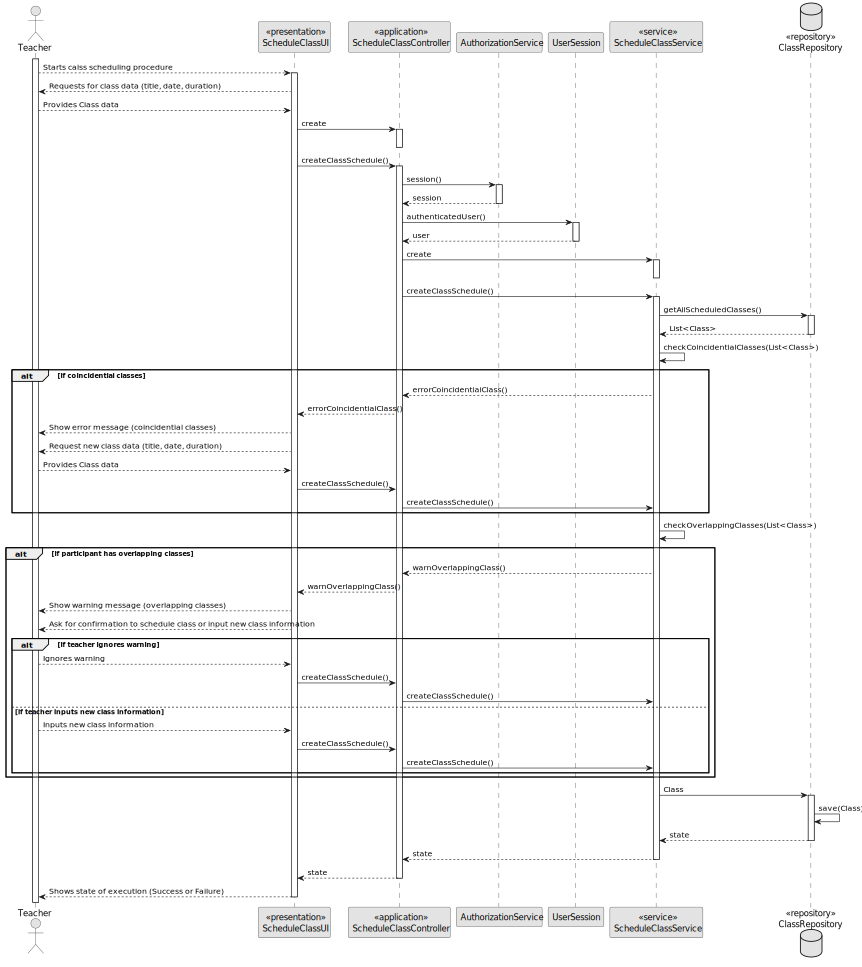
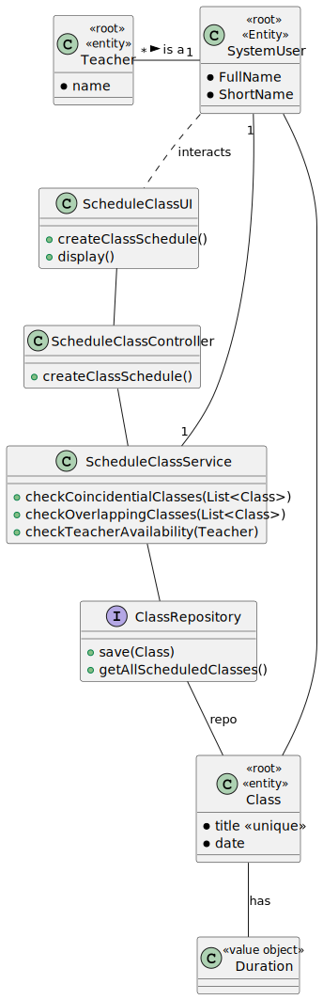

# US 1010

*As a Teacher, I want to schedule a class*

## 1. Context

*It is the first time the task is assigned to be developed*

## 2. Requirements

**US 1010** As a Teacher, schedule a class (always a recurring class, happens every week). System must check if the Teacher is available for the class period.

*Regarding this requirement we understand that it relates to the handling of a weekly class schedule by the teacher.*

## 3. Analysis

*This user story was tackled in the following ways:*

* Use a service to do the work and intercomunicate with the repository.
* The Teacher is asked with details to fill the class schedule, such as class title, date and duration.
* The service then works with the repository to save the new list of applications.
* The controller is used as a bridge between the UI and the service.


## 4. Design

  

### 4.1. Realization

>INSERT INTO CLASSSCHEDULE (TITLE, DATE, DURATION)
> VALUES (title, date, duration)

### 4.2. Class Diagram



### 4.3. Applied Patterns

### 4.4. Tests

```
@Test
    void createClassScheduleTest(){

        ClassSchedule classSchedule1 = new ClassSchedule("ClassTest1", 90, LocalDateTime.now());
        repo.save(classSchedule1);

        ClassSchedule classSchedule2 = new ClassSchedule("ClassTest2", 90, LocalDateTime.now().plusHours(5));
        repo.save(classSchedule2);

        ClassSchedule classSchedule3 = new ClassSchedule("ClassTest3", 90, LocalDateTime.now().plusHours(10));
        repo.save(classSchedule3);

        when(repo.getClassByTitle("ClassTest1")).thenReturn(classSchedule1);
        when(repo.getClassByTitle("ClassTest2")).thenReturn(classSchedule2);
        when(repo.getClassByTitle("ClassTest3")).thenReturn(classSchedule3);

        assertEquals(classSchedule1, repo.getClassByTitle("ClassTest1"));
        assertEquals(classSchedule2, repo.getClassByTitle("ClassTest2"));
        assertEquals(classSchedule3, repo.getClassByTitle("ClassTest3"));

    }
````

## 5. Implementation

### - Class ScheduleClassService

```java
 private boolean checkCoincidentialClasses(ClassSchedule classSchedule, List<ClassSchedule> existingClasses){
        if (!existingClasses.isEmpty()) {
            for (ClassSchedule existingClass : existingClasses) {
                try {
                    if (existingClass.title().classTitle().equals(classSchedule.title().classTitle())) {
                        throw new IllegalArgumentException("Class with this title already exists. Not saved!");
                    }

                    LocalDateTime existingClassDate = existingClass.date();
                    for (int i = 0; i < WEEKS_IN_A_SEMESTER; i++) { // 16 amount of weeks in a semester
                        LocalDateTime startDate = existingClassDate;
                        LocalDateTime endDate = existingClassDate.plusMinutes(existingClass.duration());
                        if (classSchedule.date().isAfter(startDate) && classSchedule.date().isBefore(endDate)
                                || classSchedule.date().isEqual(startDate) || classSchedule.date().isEqual(endDate)) {
                            throw new IllegalArgumentException("Class with this date already exists. Not saved!");
                        }
                        existingClassDate.plusDays(7);
                    }
                }catch (IllegalArgumentException e){
                    System.out.println(e.getMessage());
                    return false;
                }
            }
        }
        return true;
    }

```

## 6. Integration/Demonstration

*In this section the team should describe the efforts realized in order to integrate this functionality with the other parts/components of the system*

*It is also important to explain any scripts or instructions required to execute an demonstrate this functionality*

## 7. Observations

*This section should be used to include any content that does not fit any of the previous sections.*

*The team should present here, for instance, a critical prespective on the developed work including the analysis of alternative solutioons or related works*

*The team should include in this section statements/references regarding third party works that were used in the development this work.*