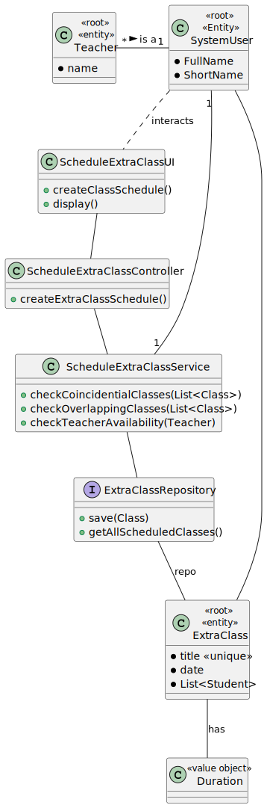

# US 1011

*As a Teacher, I want to schedule an extraordinary class*

## 1. Context

*It is the first time the task is assigned to be developed*

## 2. Requirements

**Schedule of Extra Class** A teacher schedule an extraordinary class. An extra
class is a one occurrence only and it has a specific group of participants (a subset of the
class students)

Regarding this requirement we understand that it relates to the handling and schedule of an extraordinary class that incorporate a smaller group of students than a regular class.

## 3. Analysis

*This user story was tackled in the following ways:*

* Use a service to do the work and intercomunicate with the repository.
* The Teacher is asked with details to fill the extra class schedule, such as class title, date, duration and a list of students.
* The service then works with the repository to save the new list of applications.
* The controller is used as a bridge between the UI and the service.


## 4. Design


### 4.1. Realization


>INSERT INTO CLASSSCHEDULE (TITLE, DATE, DURATION, STUDENTS
> VALUES (title, date, duration, studentList)

### 4.2. Class Diagram



### 4.3. Applied Patterns

### 4.4. Tests

**Test 1:** *Verifies that it is not possible to create an instance of the Example class with null values.*

```java
@Test
    void createClassScheduleTest(){

        ExtraClass classSchedule1 = new ExtraClass("ClassTest1", 90, LocalDateTime.now(),studentList);
        repo.save(classSchedule1);

        ExtraClass classSchedule2 = new ExtraClass("ClassTest2", 90, LocalDateTime.now().plusHours(5), studentList);
        repo.save(classSchedule2);

        ExtraClass classSchedule3 = new ExtraClass("ClassTest3", 90, LocalDateTime.now().plusHours(10), studentList);
        repo.save(classSchedule3);


        when(repo.getAll()).thenReturn(List.of(classSchedule1, classSchedule2, classSchedule3));
        assertEquals(classSchedule1, repo.getClassByTitle("ClassTest1"));
        assertEquals(classSchedule2, repo.getClassByTitle("ClassTest2"));
        assertEquals(classSchedule3, repo.getClassByTitle("ClassTest3"));

    }
````

## 5. Implementation

### - Class ScheduleExtraClassService

```java
public List<eCourseSystemUser> getAllStudents() {
        List<eCourseSystemUser> studentList = new ArrayList<>();
        List<eCourseSystemUser> userList = eCourseUserRepo.listSystemUsers();
        for (eCourseSystemUser user : userList) {
            if (user.eCourseUserRole().equals("STUDENT")) {
                userList.add(user);
            }
        }
        return studentList;
    }
```

## 6. Integration/Demonstration

*In this section the team should describe the efforts realized in order to integrate this functionality with the other parts/components of the system*

*It is also important to explain any scripts or instructions required to execute an demonstrate this functionality*

## 7. Observations

*This section should be used to include any content that does not fit any of the previous sections.*

*The team should present here, for instance, a critical prespective on the developed work including the analysis of alternative solutioons or related works*

*The team should include in this section statements/references regarding third party works that were used in the development this work.*