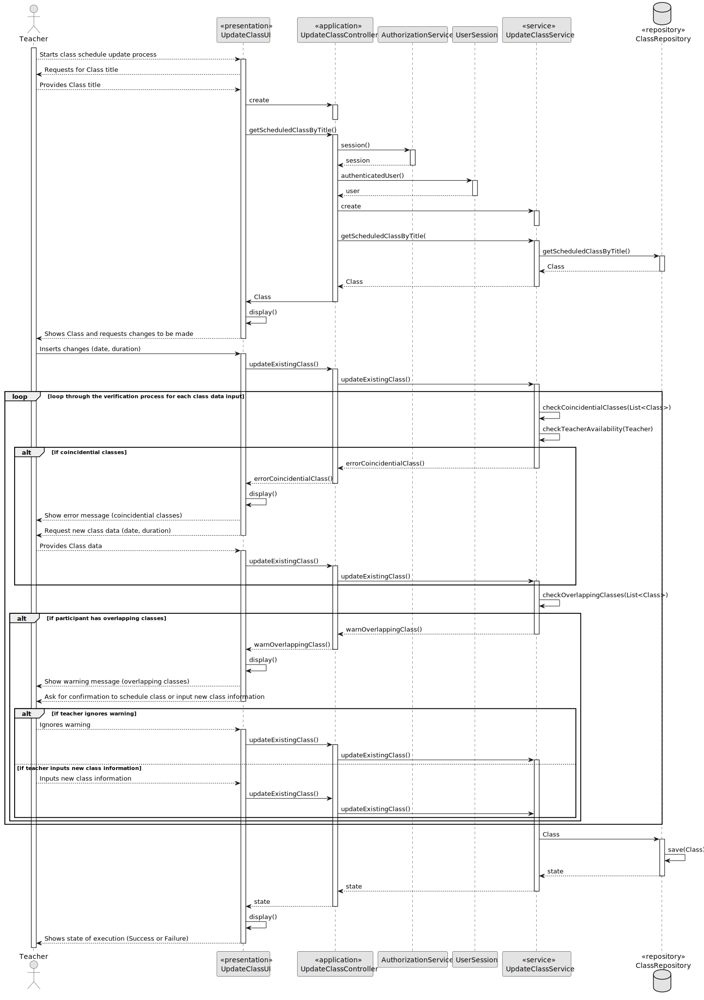
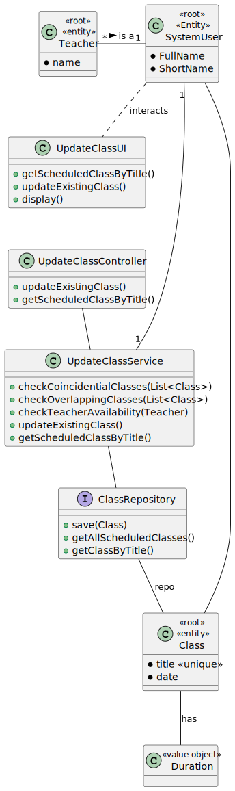

# US 1012

*As a Teacher, I want to update the schedule of a class*

## 1. Context

*It is the first time the task is assigned to be developed*

## 2. Requirements

**Update Schedule of Class** A teacher changes the time of a specific class (only changes a specific occurrence of a recurring class).

Regarding this requirement we understand that it relates to the handling and re-schedule of an already existing class

## 3. Analysis

*This user story was tackled in the following ways:*

* Use a service to do the work and intercomunicate with the repository.
* The Teacher is asked to input the class to be changed and then asked to change the fields of the schedule.
* The service then works with the repository to save the new list of applications.
* The controller is used as a bridge between the UI and the service.

## 4. Design



### 4.1. Realization

>UPDATE ClassSchedule
>SET Class_Date = date, Class_Duration = duration
>WHERE ClassTitle = title;

### 4.2. Class Diagram



### 4.3. Applied Patterns

### 4.4. Tests

```java
@Test
    void updateClassSchedule() {

        ClassSchedule classSchedule1 = new ClassSchedule("ClassTest1", 90, LocalDateTime.now());
        repo.save(classSchedule1);

        when(repo.getAll()).thenReturn(List.of(classSchedule1));
        assertEquals(classSchedule1, repo.getAll().get(0));


    }
````

## 5. Implementation

```java
private boolean checkCoincidentialClasses(LocalDateTime date, List<ClassSchedule> existingClasses, String currentClassTitle){
        if (!existingClasses.isEmpty()) {
            for (ClassSchedule existingClass : existingClasses) {
                try {
                    if (existingClass.title().classTitle().equals(currentClassTitle)) {
                        continue;
                    }
                    LocalDateTime existingClassDate = existingClass.date();
                    for (int i = 0; i < WEEKS_IN_A_SEMESTER; i++) { // 16 amount of weeks in a semester
                        LocalDateTime startDate = existingClassDate;
                        LocalDateTime endDate = existingClassDate.plusMinutes(existingClass.duration());
                        if (date.isAfter(startDate) && date.isBefore(endDate) || date.isEqual(startDate) || date.isEqual(endDate)) {
                            throw new IllegalArgumentException("Class with this date already exists. Not saved!");
                        }
                        existingClassDate.plusDays(7);
                    }
                }catch (IllegalArgumentException e){
                    System.out.println(e.getMessage());
                    return false;
                }
            }
        }
        return true;
    }
```
## 6. Integration/Demonstration

*In this section the team should describe the efforts realized in order to integrate this functionality with the other parts/components of the system*

*It is also important to explain any scripts or instructions required to execute an demonstrate this functionality*

## 7. Observations

*This section should be used to include any content that does not fit any of the previous sections.*

*The team should present here, for instance, a critical prespective on the developed work including the analysis of alternative solutioons or related works*

*The team should include in this section statements/references regarding third party works that were used in the development this work.* 
