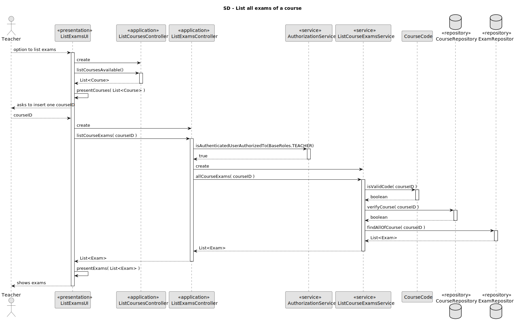
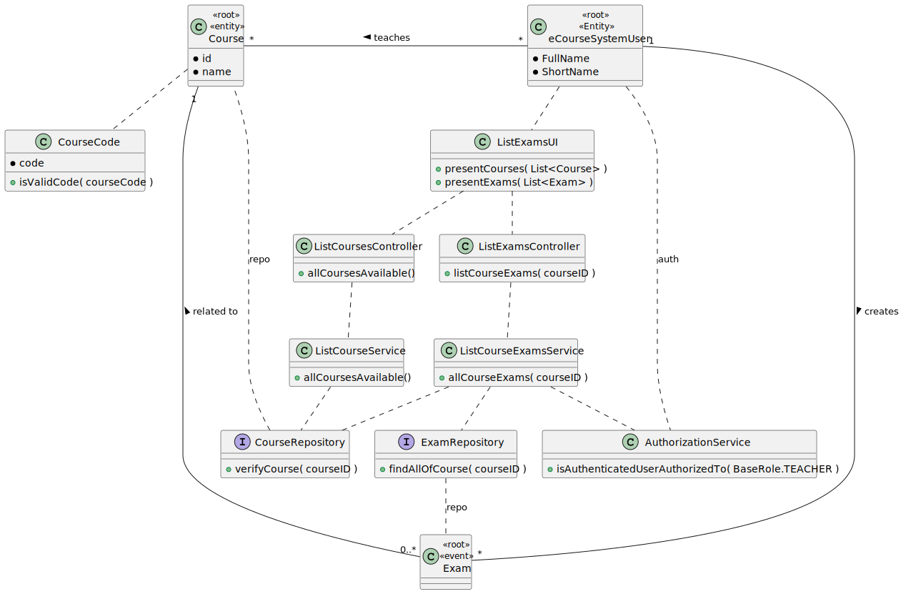

# US 2003

As Teacher, I want to view a list of all exams in a course

## 1. Context

It is the first time this tasked is assigned to be developed.

>### **From System Specification :**
> **FRE03** - List Course Exams The system displays to a teacher of a course all the exams
>of the course
## 2. Requirements


**US 2003** As a Teacher I want to view a list of all exams in a course


*Regarding this requirement we understand that it relates to a functionality exclusively for the Teachers, which allow them to see all the exams of a Course.
## 3. Analysis

**Possible Solution:**

- Reuse the US1006 to get the courses available for the teacher and display them to the User.
- Use a service (ListCourseExamsService) to do the work and interact with the CourseRepository and ExamRepository.
- Do a query in the database of Courses with the courseID to see if it is a valid course.
- Do a query in the database of Exams which selects all the exams with the given courseID.

## 4. Design



### 4.1. Realization

### 4.2. Class Diagram



### 4.3. Applied Patterns

### 4.4. Tests
**Test Setup:**
```
@BeforeAll
static void setup() {
    examRepo = mock(ExamRepository.class);
    courseRepo = mock(CourseRepository.class);
    ...
    when(courseRepo.verifyCourse("EMPTY")).thenReturn(true);
    when(courseRepo.verifyCourse("TEST1")).thenReturn(true);
    when(courseRepo.verifyCourse("NULLL")).thenReturn(false);
    ...
    when(examRepo.findAllOfCourse(CourseCode.valueOf("EMPTY"))).thenReturn(new ArrayList<>());
    when(examRepo.findAllOfCourse(CourseCode.valueOf("TEST1"))).thenReturn(examList);
    service = new ListCourseExamsService(examRepo, courseRepo);
}
```

**Test 1:** *Verifies that it's not possible to return a list of exams of a course giving an invalid CourseCode.*
```
@Test
void testInvalidCourseCodeToListExamsFrom() {
    String courseCodeTest= "invalid";
    assertNull(service.allCourseExams(courseCodeTest));
}
````

**Test 2:** *Verifies that it's not possible to return a list of exams of a course giving a valid CourseCode of a non-existing Course.*
```
@Test
void testNonExistingCourseCodeToListExamsFrom() {
    when(courseRepo.verifyCourse("NULLL")).thenReturn(false);
    String courseCodeTest= "NULLL";
    assertNull(service.allCourseExams(courseCodeTest));
}
````

**Test 3:** *Verifies that it returns an empty list of exams of a course giving a valid CourseCode of a Course with no exams.*
```
@Test
void testValidCourseCodeWithNoExams() {
    assertTrue(service.allCourseExams(empty.code().courseCode()).isEmpty());
}
````

**Test 4:** *Verifies that it returns a correct list of exams of a course giving a valid CourseCode of a Course with exams.*
```
@Test
void testValidCourseCodeWithExams() {
    List<Exam> result = service.allCourseExams(test1.code().courseCode());

    assertFalse(result.isEmpty());
    assertEquals(2, result.size());
    assertArrayEquals(examList.toArray(), result.toArray());
}
````

## 5. Implementation

### - Class ListCourseExamsService
```
public List<Exam> allCourseExams(String courseID ){
    if ( CourseCode.isValidCode(courseID) && courseRepo.verifyCourse(courseID) ){
        return examRepo.findAllOfCourse(CourseCode.valueOf(courseID));
    } else {
        return null;
    }
}
````
### - Class CourseCode
```
public static boolean isValidCode(String courseCode) {
    if (courseCode.length() < 5 || courseCode.length() >8) return false;
    if (!Character.isLetter(courseCode.charAt(0))) return false;
    if (!Character.isLetterOrDigit(courseCode.charAt(courseCode.length()-1))) return false;
    int counterBar=0,counterDigits=0;
    for (char c : courseCode.toCharArray()) {
        if (!Character.isUpperCase(c) && c != '-' && c != '_' && !Character.isDigit(c)) {
            return false;
        }
        if (Character.isDigit(c)){
            counterDigits++;
        }
        if (c=='_' || c == '-'){
            counterBar++;
        }
        if ( counterDigits > 1 || counterBar > 2){
            return false;
        }
    }
    return true;
}
````
### - Class JpaCourseRepository
```
@Override
public boolean verifyCourse(String code) {
    final Map<String, Object> params = new HashMap<>();
    params.put("code", code);
    return matchOne("coursecode=:code", params).isPresent();
}
````
### - Class JpaExamRepository
```
@Override
public List<Exam> findAllOfCourse(CourseCode courseCode) {
    final Map<String, Object> params = new HashMap<>();
    params.put("CourseCode", courseCode);
    return match("course.courseCode=:CourseCode", params);
}
````

## 6. Integration/Demonstration


## 7. Observations
