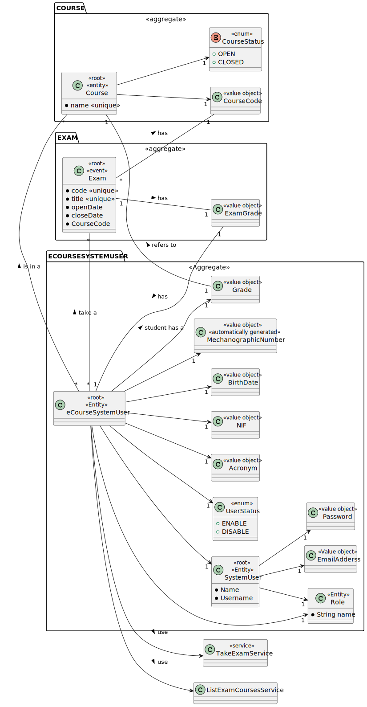
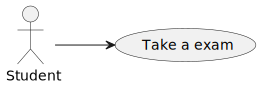
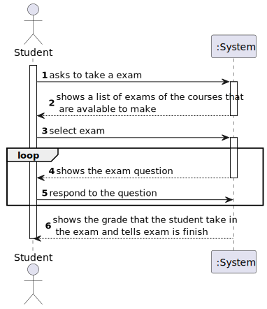
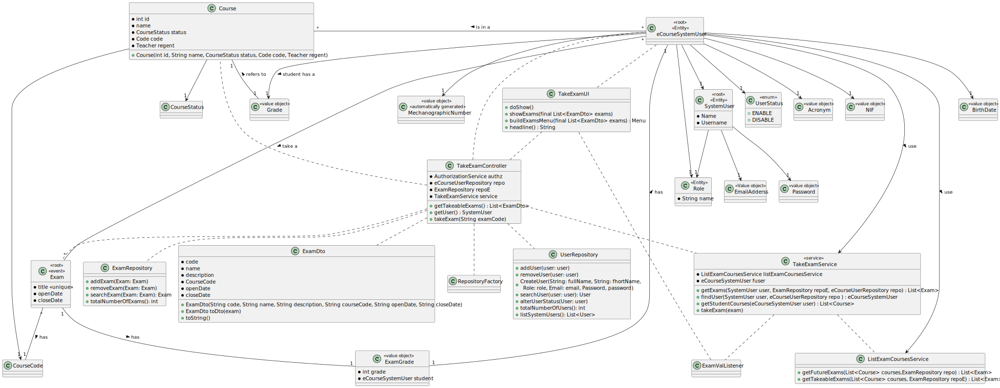
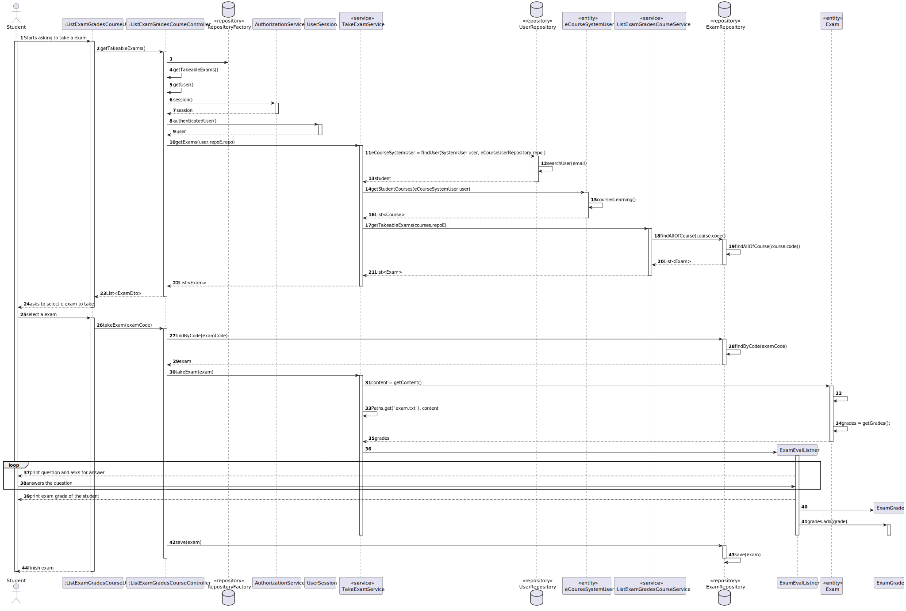

# US 2004

## 1. Context

*It is the first time the task is assigned to be developed.*

## 2. Requirements

**US 2004** As Student, I want to take an exam.

*Acceptence Criteria:*

- A Student takes an exam and answer its questions.
- At the end of the exam, the system should display the feedback and result (i.e., grade) of the exam.
- The feedback and grade of the exam should be automatically calculated by a parser based on the grammar defined for exams structure.

## 3. Analysis

*In this section, the team should report the study/analysis/comparison that was done in order to take the best design decisions for the requirement. This section should also include supporting diagrams/artifacts (such as domain model; use case diagrams, etc.),*

### Domain Model ###




### Use Case Diagram ###




### System Sequence Diagrams ###

#### Register User ####



## 4. Design

*In this sections, the team should present the solution design that was adopted to solve the requirement. This should include, at least, a diagram of the realization of the functionality (e.g., sequence diagram), a class diagram (presenting the classes that support the functionality), the identification and rational behind the applied design patterns and the specification of the main tests used to validade the functionality.*

### 4.1. Realization

### 4.2. Class Diagram



### Sequence Diagram




### 4.3. Applied Patterns

* **Model-View-Controller (MVC):** The `ListExamGradesCourseUI` class represents the **View** component, which is responsible for displaying information to the user and receiving user input. The `ListExamGradesCourseController` class represents the **Controller** component, which handles user input and updates the model accordingly. The `eCourseSystemUser`, `Exam`, and `ExamGrade` classes represent the Model **component**, which manages the data and business logic of the application.

* **Factory Method:** The `RepositoryFactory` class is used to create objects without specifying the exact class of object that will be created.

* **Service Layer:** The `AuthorizationService`, `TakeExamService`, and `ListExamGradesCourseService` classes provide a set of services to the application and encapsulate the application’s business logic.

* **Repository:** The `UserRepository` and `ExamRepository` classes are used to manage the data storage and retrieval for their respective entities.

* **Entity:** The `eCourseSystemUser`, `Exam`, and `ExamGrade` classes represent domain objects that encapsulate data and behavior related to the application’s business logic.

* **Observer:** The `ExamEvalListner` class is used to listen for events and update its state accordingly.

### 4.4. Tests

**Test 1:** *Verifies that it is not possible to create an instance of the Example class with null values.*

```
@Test(expected = IllegalArgumentException.class)
public void ensureNullIsNotAllowed() {
	Example instance = new Example(null, null);
}
````

## 5. Implementation

*In this section the team should present, if necessary, some evidencies that the implementation is according to the design. It should also describe and explain other important artifacts necessary to fully understand the implementation like, for instance, configuration files.*

*It is also a best practice to include a listing (with a brief summary) of the major commits regarding this requirement.*

## 6. Integration/Demonstration

*In this section the team should describe the efforts realized in order to integrate this functionality with the other parts/components of the system*

*It is also important to explain any scripts or instructions required to execute an demonstrate this functionality*

## 7. Observations

*This section should be used to include any content that does not fit any of the previous sections.*

*The team should present here, for instance, a critical prespective on the developed work including the analysis of alternative solutioons or related works*

*The team should include in this section statements/references regarding third party works that were used in the development this work.* 
