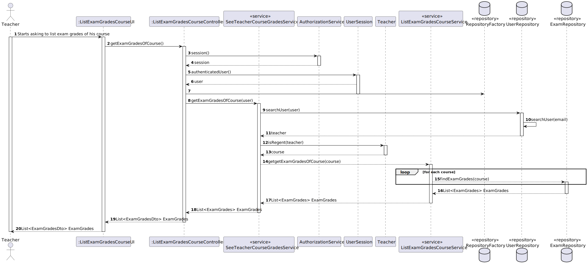

# US 2006

## 1. Context

*It is the first time the task is assigned to be developed.*

## 2. Requirements

**US 2006** As Teacher, I want to view a list of the grades of exams of my course. 

*Acceptence Criteria:*

- So far there are no acceptance criteria for this US.

## 3. Analysis

*In this section, the team should report the study/analysis/comparison that was done in order to take the best design decisions for the requirement. This section should also include supporting diagrams/artifacts (such as domain model; use case diagrams, etc.),*

### Domain Model ###


### Use Case Diagram ###


### System Sequence Diagrams ###

#### Register User ####


## 4. Design

*In this sections, the team should present the solution design that was adopted to solve the requirement. This should include, at least, a diagram of the realization of the functionality (e.g., sequence diagram), a class diagram (presenting the classes that support the functionality), the identification and rational behind the applied design patterns and the specification of the main tests used to validade the functionality.*

### 4.1. Realization

### 4.2. Class Diagram


### Sequence Diagram




### 4.3. Applied Patterns

* **Model-View-Controller (MVC):** The `ListExamGradesCourseUI` class represents the **View** component, which is responsible for displaying information to the user and receiving user input. The `ListExamGradesCourseController` class represents the **Controller** component, which handles user input and updates the model accordingly. The `Teacher` class represents the **Model** component, which manages the data and business logic of the application.

* **Pure Fabrication:** The `SeeTeacherCourseGradesService`, `AuthorizationService`, and `ListExamGradesCourseService` are responsible for handling specific tasks that do not directly correspond to a problem domain concept.

* **Factory Method:** The `RepositoryFactory` class is used to create objects without specifying the exact class of object that will be created.

* **Service Layer:** The `SeeTeacherCourseGradesService`, `AuthorizationService`, and `ListExamGradesCourseService` classes provide a set of services to the application and encapsulate the application’s business logic.

* **Repository:** The `UserRepository` and `ExamRepository` classes are used to manage the data storage and retrieval for their respective entities.

### 4.4. Tests

**Test 1:** Verifies that the findExamGrades method of the listExamGradesCourseService class correctly returns a list of exam grades for a given course.

```
@Test
    public void findExamGrades() throws ParseException {
        SystemUserBuilder sB = new SystemUserBuilder(new BasePasswordPolicy(), new PlainTextEncoder());
        sB.withName("Katy", "Doe");
        sB.withUsername("katydoe");
        sB.withEmail("isep200@gmail.com");
        sB.withPassword("Password23");
        sB.withRoles(Role.valueOf("Teacher"));
        SystemUser systemUser = sB.build();

        eCourseSystemUser user = new eCourseSystemUser(EmailAddress.valueOf("isep123@gmail.com"), systemUser, Acronym.valueOf("POD"), NIF.valueOf("123456786"), BirthDate.valueOf("01/01/1990"));

        Course course = new Course(CourseCode.valueOf("ISEPP"), "Isep", user, 10, 100, "Isep 2023");

        Date opendate=new SimpleDateFormat("dd/MM/yyyy").parse("01/01/2024");
        Date closedate=new SimpleDateFormat("dd/MM/yyyy").parse("01/02/2024");

        Exam exam = new Exam("EAPLE","Eapli","First exam of EAPLI",course.code(),opendate,closedate);
        Exam exam2 = new Exam("EAPLE2","Eapli2","Second exam of EAPLI",course.code(),opendate,closedate);
        List<Exam> exams  = new ArrayList<>();
        exams.add(exam);
        exams.add(exam2);

        sB.withName("John", "Doe");
        sB.withUsername("johndoe");
        sB.withEmail("isep123@gmail.com");
        sB.withPassword("Password23");
        sB.withRoles(Role.valueOf("STUDENT"));
        SystemUser systemUser2 = sB.build();

        eCourseSystemUser user2 = new eCourseSystemUser(EmailAddress.valueOf("isep123@gmail.com"), systemUser2, MecanographicNumber.valueOf("123456789"), NIF.valueOf("123456786"), BirthDate.valueOf("01/01/1990"));


        ExamGrade examGrade = new ExamGrade(user2, 10);
        ExamGrade examGrade2 = new ExamGrade(user2, 20);
        exam.addExamGrade(examGrade);
        exam.addExamGrade(examGrade2);

        when(examRepository.findAllOfCourse(course.code())).thenReturn(exams);
        List<ExamGrade> examGrades = listExamGradesCourseService.findExamGrades(course, examRepository);

        Assertions.assertEquals(2, examGrades.size());
    }
````

## 5. Implementation

*In this section the team should present, if necessary, some evidencies that the implementation is according to the design. It should also describe and explain other important artifacts necessary to fully understand the implementation like, for instance, configuration files.*

*It is also a best practice to include a listing (with a brief summary) of the major commits regarding this requirement.*

## 6. Integration/Demonstration

*In this section the team should describe the efforts realized in order to integrate this functionality with the other parts/components of the system*

*It is also important to explain any scripts or instructions required to execute an demonstrate this functionality*

## 7. Observations

*This section should be used to include any content that does not fit any of the previous sections.*

*The team should present here, for instance, a critical prespective on the developed work including the analysis of alternative solutioons or related works*

*The team should include in this section statements/references regarding third party works that were used in the development this work.* 
