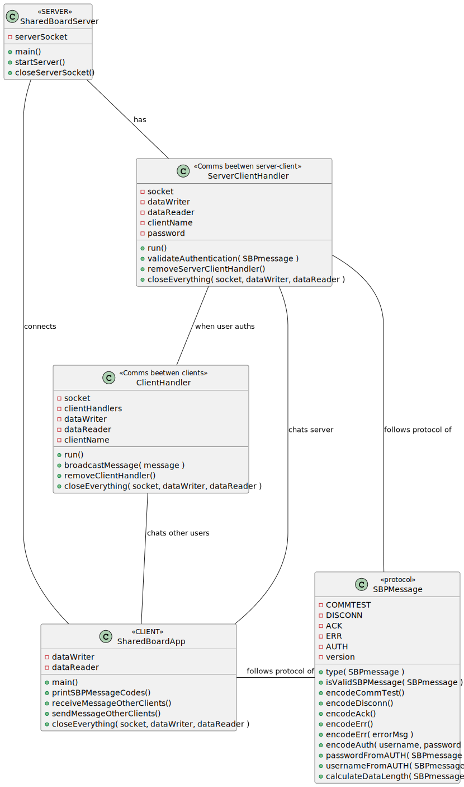

# US 3001

As Project Manager, I want the team to prepare the communication infrastruture for the Shared Boards and the depoyment of the solution.

## 1. Context

>### **Acceptance Criteria:**
> - This functional part of the system has very specific technical requirements. It must follow a client-server architecture, where a client application is used to access the shared boards that should be implemented in a server. Communications between these two components must follow specific protocol described in a document from RCOMP ("Application Protocol"). Also, the client application can not access the relational database, it can only access the server application.
> - The solution should be deployed using several network nodes. It is expected that, at least, the relational database server and the shared board server be deployed in nodes different from localhost, preferably in the cloud.

## 2. Requirements


## 3. Analysis


## 4. Design


### 4.1. Realization

### 4.2. Class Diagram


### 4.3. Applied Patterns

### 4.4. Tests

**Test 1:** Test the encodeCommTest() method.
```
@Test
void testEncodeCommTest() {
    char[] expected = new char[]{'1','0','0','0'};
    char[] result = SBPMessage.encodeCommTest();
    Assertions.assertArrayEquals(expected, result);
}
```
**Test 2:** Test the encodeDisconn() method.
```
@Test
void testEncodeDisconn() {
    char[] expected = "1100".toCharArray();
    char[] result = SBPMessage.encodeDisconn();
    assertArrayEquals(expected, result);
}
```
**Test 3:** Test the encodeAck() method.
```
@Test
void testEncodeAck() {
    char[] expected = "1200".toCharArray();
    char[] result = SBPMessage.encodeAck();
    assertArrayEquals(expected, result);
}
```
**Test 4/5:** Test the encodeErr() method.
```
@Test
void testEncodeErr() {
    char[] expected = "1300".toCharArray();
    char[] result = SBPMessage.encodeErr();
    assertArrayEquals(expected, result);
}
@Test
void testEncodeErrWithMessage() {
    char[] msg = "Error message".toCharArray();
    int dataLength = msg.length;
    int length1 = dataLength % 256;
    int length2 = dataLength / 256;
    char[] expected = new char[4 + dataLength];
    expected[0] = '1';
    expected[1] = '3';
    expected[2] = (char)length1;
    expected[3] = (char)length2;
    for (int i = 0; i < dataLength; i++) {
        expected[4 + i] = msg[i];
    }
    assertArrayEquals(expected, SBPMessage.encodeErr(msg));
}
```
**Test 6:** Test the encodeAuth() method.
```
@Test
void testEncodeAuth() {
    char[] username = "username".toCharArray();
    char[] password = "password".toCharArray();
    char[] msg = new char[username.length + password.length + 2];
    for (int i = 0; i < username.length; i++) {
        msg[i] = username[i];
    }
    msg[username.length] = '\0';
    for (int i = 0; i < password.length; i++) {
        msg[username.length + 1 + i] = password[i];
    }
    msg[username.length + 1 + password.length] = '\0';

    int dataLength = msg.length;
    int length1 = dataLength % 256;
    int length2 = dataLength / 256;
    char[] expected = new char[4 + dataLength];
    expected[0] = '1';
    expected[1] = '4';
    expected[2] = (char)length1;
    expected[3] = (char)length2;
    for (int i = 0; i < dataLength; i++) {
        expected[4 + i] = msg[i];
    }
    assertArrayEquals(expected, SBPMessage.encodeAuth(username, password));
}
```
**Test 7:** Test the type() method.
```
@Test
void testType() {
    char[] msgCOMMTEST = "1000".toCharArray();
    char[] msgDISCONN = "1100".toCharArray();
    char[] msgACK = "1200".toCharArray();
    char[] msgERR = "1300".toCharArray();
    char[] msgAUTH = "1400".toCharArray();

    assertEquals('0', SBPMessage.type(msgCOMMTEST));
    assertEquals('1', SBPMessage.type(msgDISCONN));
    assertEquals('2', SBPMessage.type(msgACK));
    assertEquals('3', SBPMessage.type(msgERR));
    assertEquals('4', SBPMessage.type(msgAUTH));
}
```
**Test 8:** Test the isValidSBPMessage() method.
```
@Test
void testIsValidSBPMessage() {
    char[] fail1 = "0000".toCharArray();
    char[] fail2 = "1001".toCharArray();
    char[] fail3 = "1210".toCharArray();

    assertFalse(SBPMessage.isValidSBPMessage(fail1));
    assertFalse(SBPMessage.isValidSBPMessage(fail2));
    assertFalse(SBPMessage.isValidSBPMessage(fail3));
}
```
**Test 9:** Test the usernameFromAUTH() method.
```
@Test
void testUsernameFromAUTH() {
    char[] username = "username".toCharArray();
    char[] password = "password".toCharArray();
    char[] result = SBPMessage.encodeAuth(username, password);
    assertArrayEquals(username, SBPMessage.usernameFromAUTH(result));
}
```
**Test 10:** Test the passwordFromAUTH() method.
```
@Test
void testPasswordFromAUTH() {
    char[] username = "username".toCharArray();
    char[] password = "password".toCharArray();
    char[] result = SBPMessage.encodeAuth(username, password);
    assertArrayEquals(password, SBPMessage.passwordFromAUTH(result));
}
````

## 5. Implementation

### - Class SharedBoardServer
````
private void startServer() throws IOException {
    try {
        while ( !serverSocket.isClosed() ){
            Socket socket = serverSocket.accept();
            new Thread(new ServerClientHandler(socket)).start();
        }
    } catch (IOException ex) {
        System.out.println("Failed to accept client connection");
        closeServerSocket();
    }
}
````
### - Class ServerClientHandler
````
@Override
public void run() {
    char[] messageFromClient,buffer;
    int bytesRead;
    System.out.println("SERVER: Client connected");
    while ( socket.isConnected()) {
        try {
            buffer = new char[1024];
            bytesRead = dataReader.read(buffer);
            messageFromClient = new char[bytesRead];
            for (int i = 0; i < bytesRead; i++) {
                messageFromClient[i] = buffer[i];
            }

            if (messageFromClient != null) {
                System.out.println(" -! New message received: " + messageFromClient);
                switch ( SBPMessage.type(messageFromClient) ){
                    case SBPMessage.COMMTEST: ...
                    case SBPMessage.ACK: ... 
                    case SBPMessage.ERR: ... 
                    case SBPMessage.DISCONN: ...
                    case SBPMessage.AUTH: ...
                    default: ...
                }
            }
        } catch (IOException e) {
            closeEverything( socket, dataWriter, dataReader);
            break;
        }
    }
}
````
### - Class SharedBoardApp
````
public static void main(String[] args) throws IOException {
    Socket sock = new Socket("localhost", 9999);    

    OutputStreamWriter dataWriterSv = new OutputStreamWriter(sock.getOutputStream());
    InputStreamReader dataReaderSv = new InputStreamReader(sock.getInputStream());
    Scanner scanner = new Scanner(System.in);
    char[] buffer;
    int bytesRead;
    while (true) {
        char SBPcode = printSBPMessageCodes();
        switch (SBPcode) {
            case SBPMessage.COMMTEST:...
            case SBPMessage.ACK: ...
            case SBPMessage.ERR: ...
            case SBPMessage.DISCONN: ...
            case SBPMessage.AUTH: ...
            default: ...
        }
    }
}
````
### - Class ClientHandler
````
private void broadcastMessage(String message) {
    for ( ClientHandler clientHandler : clientHandlers ) {
        try {
            if ( !clientHandler.clientName.equals( this.clientName ) ) {
                clientHandler.dataWriter.write(message + "\n");
                clientHandler.dataWriter.flush();
            }
        } catch (IOException e) {
            closeEverything( socket, dataWriter, dataReader );
        }
    }
}
````
### - Class SBPMessage
````
public static char[] encodeAuth( char[] usernameChar, char[] passwordChar ) {
    int dataLength = usernameChar.length + passwordChar.length + 2;
    int D_LENGTH_2 = dataLength / 256;
    int D_LENGTH_1 = dataLength % 256;
    char[] msg = new char[4 + dataLength];
    msg[0] = SBPMessage.version;
    msg[1] = SBPMessage.AUTH;
    msg[2] = (char)D_LENGTH_1;
    msg[3] = (char)D_LENGTH_2;
    int i;
    for ( i = 0; i < usernameChar.length; i++ ) {
        msg[4 + i] = usernameChar[i];
    }
    msg[4 + i] = '\0';
    i++;
    for ( int j = 0; j < passwordChar.length; j++ ) {
        msg[4 + i + j] = passwordChar[j];
    }
    msg[4 + i + passwordChar.length] = '\0';
    return msg;
}
````

## 6. Integration/Demonstration


## 7. Observations

