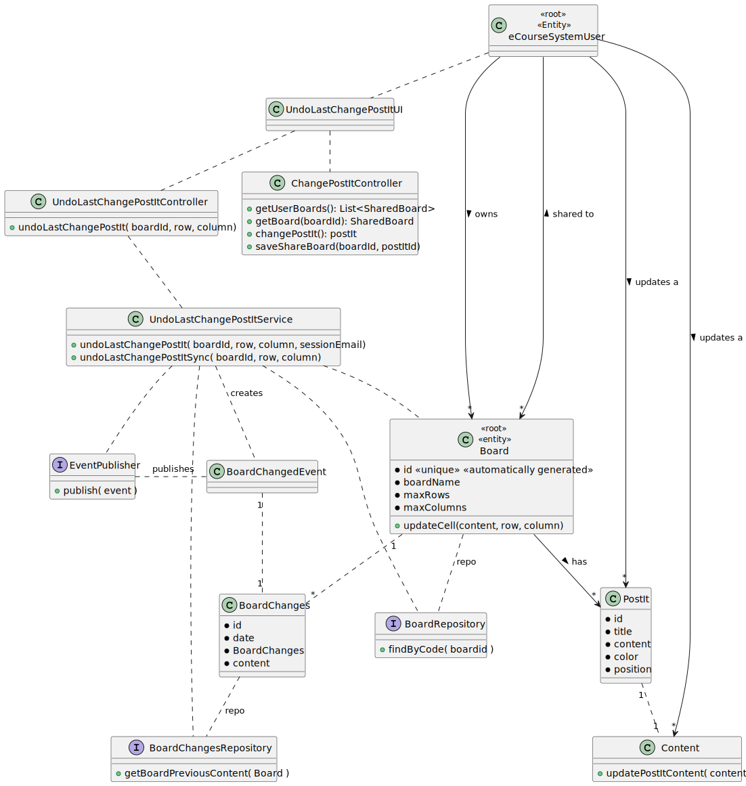

# US 3008

As User, I want to undo the last change in a post-it.

## 1. Context


>### **Project Description:**
> **FRB06** - Undo Post-it Change A user undo the last change in a post-it

>### **Client Forum:**
>

## 2. Requirements


**US 3008** As User, I want to undo the last change in a post-it.

*Regarding this requirement we understand that it relates to all Users and does not have any specific case for a user role. Therefore, we will consider that this requirement it works equally for all user roles.*

## 3. Analysis

>### **Acceptance Criteria:**
> - This functional part of the system has very specific technical requirements, particularly some concerns about synchronization problems.
> - In fact, several clients will try to concurrently update boards.
> - As such, the solution design and implementation must be based on threads, condition variables and mutexes. Specific requirements will be provided in SCOMP.

>### **Dependencies:**
> - This US depends on the **US 3006: As User, I want to create a post-it on a board**, because we cannot undo a change in a post-it if the post-it doesn´t exist.
> - This US depends on the **US 3007: As User, I want to change a post-it**, because we cannot undo a change in a post-it if it has no changes.


## 4. Design

### 4.1. Realization
#### Sequence Diagram


### 4.2. Class Diagram



### 4.3. Applied Patterns

* **Singleton:** The `SharedBoardServer` class uses the `getInstance()` method to ensure that only one instance of the class is created.

* **Factory Method:** The `RepositoryFactory` class is used to create objects without specifying the exact class of object that will be created.

* **Service Layer:** The `UserAccessBoardsService`, `AuthorizationService`, and `UndoLastChangePostItService` classes provide a set of services to the application and encapsulate the application’s business logic.

* **Repository:** The `BoardRepository` and `BoardChangesRepository` classes are used to manage the data storage and retrieval for their respective entities.

* **Publisher/Subscriber:** The `EventPublisher` class is used to publish events to subscribers.

* **Data Mapper:** The `PostItMapper` class is used to map between the data model and the domain model.


### 4.4. Tests

**Test 1:** Ensure that the method throws an exception when the row is invalid. 
````
@Test
void testUndoLastChangePostItWithInvalidRow() {
    assertThrows(NullPointerException.class, () -> undoLastChangePostItService.undoLastChangePostIt(board, 11, 0));
}
````
**Test 2:** Ensure that the method throws an exception when the column is invalid. 
````
@Test
void testUndoLastChangePostItWithInvalidColumn() {
    assertThrows(NullPointerException.class, () -> undoLastChangePostItService.undoLastChangePostIt(board, 0, 11));
}
````
**Test 3:** Ensure that the method works as expected when the row and column are valid. 
````
@Test
void testUndoLastChangePostItWithValidParams() {
    assertEquals("teste2", board.GetPostIt(0, 0).getContent().content());
    PostItDto postItDto = undoLastChangePostItService.undoLastChangePostIt(board, 0, 0);
    assertEquals("teste", postItDto.content());
}
````
**Test 4:** Ensure that the method works as expected when the boardid is invalid.
````
@Test
void testUndoLastChangePostItWithInvalidBoardId() {
    assertNull(undoLastChangePostItService.undoLastChangePostIt("123", 0, 0,sessionEmail));
}
````


## 5. Implementation
### Class UndoLastChangePostItController
````
public PostItDto undoLastChangePostIt(String boardId,int row,int column){
    EmailAddress sessionEmail = AuthzRegistry.authorizationService().session().get().authenticatedUser().email();
    return service.undoLastChangePostIt(boardId,row,column,sessionEmail);
}
````
### Class UndoLastChangePostItService
````
public PostItDto undoLastChangePostIt(String boardId, int row, int column, EmailAddress sessionEmail){
    Board board = undoLastChangePostItSync(boardId, row, column);
    if (board == null) return null;
    if (board.GetPostIt(row, column) == null) return null;
    if (board.GetPostIt(row, column).getContent() == null) return null;
    DomainEvent event = new BoardChangedEvent(
        new BoardChanges(board,
            LocalDateTime.now(),
            "PostIt in row " + row + " and column " + column + ": had undone change by "+ sessionEmail+ "\n",
            board.GetPostIt(row, column).getContent().content()
        ));
    publisher.publish(event);
    return PostItMapper.toDto(board.GetPostIt(row, column));
}
private synchronized Board undoLastChangePostItSync(String boardId, int row, int column){
    Board board = null;
    Optional<Board> boardOptional = boardRepository.findByCode(Long.parseLong(boardId));
    if (boardOptional.isPresent()) {
        board = boardOptional.get();
        String content = boardChangesRepository.getBoardPreviousContent(board);
        if (content != null) {
            try {
                board.updateCell(content, row, column, boardRepository);
                boardRepository.save(board);
            } catch (Exception e) {
                System.out.println(" Couldn´t undo change !");
            }
        }
    }
    return board;
}
````
### Class JpaBoardChangesRepository
````
@Override
public String getBoardPreviousContent(Board board) {
    List<BoardChanges> boardChangesList = findByBoard(board);
    if(boardChangesList.size() <= 1){
        return null;
    } else {
        Collections.sort(boardChangesList, new Comparator<BoardChanges>() {
            @Override
            public int compare(BoardChanges change1, BoardChanges change2) {
                return change1.Date().compareTo(change2.Date());
            }
        });
        // boardChangesList.size()-2  :because the last change is the current one
        return boardChangesList.get(boardChangesList.size()-2).content();
    }
}
````
### Class Board
````
public synchronized  void updateCell(String newContent, int row, int column){
    if (CheckPostItPlacementUpdate(row, column)) {
        postIts.get(new Pair<>(row, column)).getContent().updatePostItContent(newContent);
    } else {
        throw new IllegalStateException("Cell has no post-it to update");
    }
}
````

## 6. Integration/Demonstration


## 7. Observations

