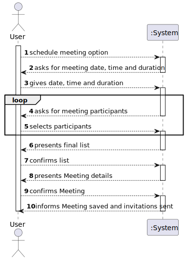
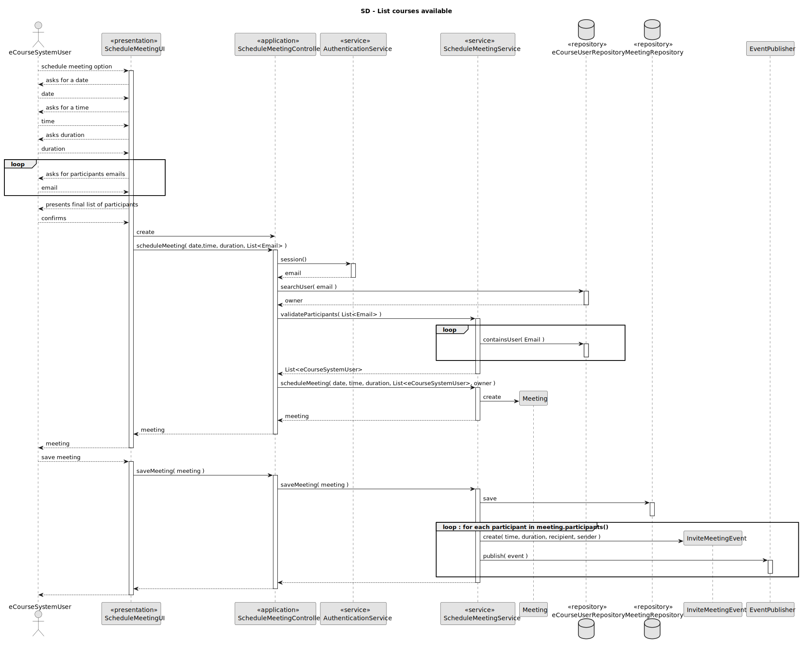
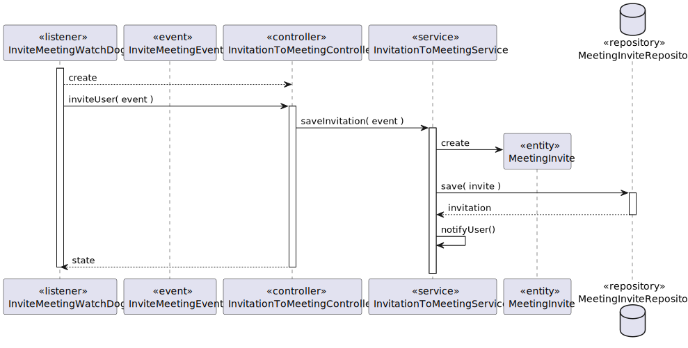
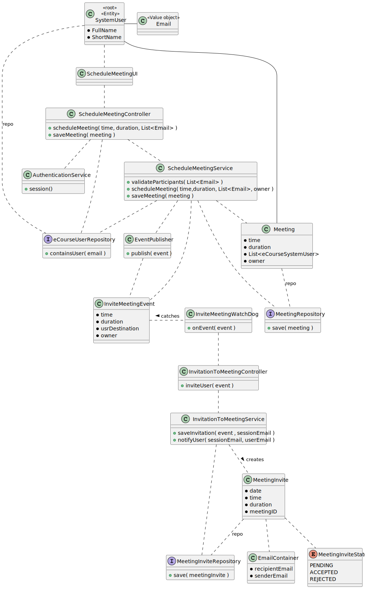

# US 4001

As User, I want to schedule a meeting.

## 1. Context


>### **Project Description:**
>
>**FRM01** - Schedule a Meeting A user schedules a meeting. The system must check if
>all participants are available and send invitations to participants.


## 2. Requirements


**US G002** As User, I want to schedule a meeting

*Regarding this requirement we understand that it relates to all Users and does not have any specific case for a user role. Therefore, we will consider that this requirement it works equally for all user roles.*

## 3. Analysis

>### **Acceptance Criteria:**
>- The system must check if all participants are available and send invitations to participants.
>- The sytem must check if the date is valid.
>- The system must check if the time is valid.

## 4. Design



### 4.1. Realization


### WatchDog Logic Diagram



### 4.2. Class Diagram



### 4.3. Applied Patterns

* **Factory Method:** The `RepositoryFactory` class is used to create objects without specifying the exact class of object that will be created.

* **Service Layer:** The `AuthenticationService` and `ScheduleMeetingService` classes provide a set of services to the application and encapsulate the application’s business logic.

* **Repository:** The `eCourseUserRepository`, `MeetingRepository` and `MeetingInviteRepository` classes are used to manage the data storage and retrieval for their respective entities.

* **Publisher/Subscriber:** The `EventPublisher` class is used to publish events to subscribers.


### 4.4. Tests

**Test 1:** *Verifies that it isn´t possible to create a meeting with no participants.*
```
@Test
void testScheduleMeetingWithNoParticipants(){
    LocalTime time = LocalTime.MAX;
    int duration = 60;
    List<eCourseSystemUser> participants = null;

    assertNull(service.scheduleMeeting(time,duration,participants,owner));
}
````
**Test 2:** *Verifies that it isn´t possible to create a meeting with invalid participants.*
```
@Test
void testScheduleMeetingWithInvalidParticipants(){
    LocalTime time = LocalTime.MAX;
    int duration = 60;
    EmailAddress user1 = EmailAddress.valueOf("fail@gmail.com");
    List<EmailAddress> emails = new ArrayList<>();
    emails.add(user1);
    List<eCourseSystemUser> participants = service.validateParticipants(emails);
    assertTrue(participants.isEmpty());
    assertNull(service.scheduleMeeting(time,duration,participants,owner));
}
````
**Test 3:** *Verifies that it isn´t possible to create meeting with invalid time.*
```
@Test
void testScheduleMeetingWithInvalidTime() {
    LocalTime time = LocalTime.now();
    int duration = 60;
    EmailAddress user1 = EmailAddress.valueOf("test2@gmail.com");
    List<EmailAddress> emails = new ArrayList<>();
    emails.add(user1);
    List<eCourseSystemUser> participants = service.validateParticipants(emails);

    assertNull(service.scheduleMeeting(time,duration,participants,owner));
}
````
**Test 4:** *Verifies that it isn´t possible to create meeting with invalid duration.*
```
@Test
void testScheduleMeetingWithInvalidDuration() {
    LocalTime time = LocalTime.MAX;
    int duration = -60;
    EmailAddress user1 = EmailAddress.valueOf("test2@gmail.com");
    List<EmailAddress> emails = new ArrayList<>();
    emails.add(user1);
    List<eCourseSystemUser> participants = service.validateParticipants(emails);

    assertNull(service.scheduleMeeting(time,duration,participants,owner));
}
````
**Test 5:** *Verifies that it works with all valid data.*
```
@Test
void testScheduleMeetingWithValidParameters() {
    LocalTime time = LocalTime.MAX;
    int duration = 60;
    EmailAddress user1 = EmailAddress.valueOf("test2@gmail.com");
    List<EmailAddress> emails = new ArrayList<>();
    emails.add(user1);
    List<eCourseSystemUser> participants = service.validateParticipants(emails);

    assertNotNull(service.scheduleMeeting(time,duration,participants,owner));
}
````

## 5. Implementation

### - Class ScheduleMeetingController
```
public Meeting scheduleMeeting( LocalDate date, LocalTime time, int duration, List<EmailAddress> participants) {
    EmailAddress email = authorizationService.session().get().authenticatedUser().email();
    eCourseSystemUser owner = userRepo.searchUser(email).get();
    List<eCourseSystemUser> validatedParticipants = service.validateParticipants(participants);
    return service.scheduleMeeting( date, time, duration, validatedParticipants, owner);
}
````
### - Class ScheduleMeetingService
```
public List<eCourseSystemUser> validateParticipants(List<EmailAddress> participants) {
    List<eCourseSystemUser> users = new ArrayList<>();
    eCourseSystemUser user;
    for (EmailAddress participant : participants) {
        if (!userRepo.searchUser(participant).isEmpty()) {
            user = userRepo.searchUser(participant).get();
            if (user != null) {
                users.add(user);
            }
        }
    }
    return users;
}
public Meeting scheduleMeeting(LocalDate date, LocalTime time, int duration, List<eCourseSystemUser> participants, eCourseSystemUser owner) {
    if ( time.isAfter(LocalTime.now()) && duration > 0 && !date.isBefore(LocalDate.now())) {
        if ( participants != null && participants.size() > 0) {
            Meeting meeting = new Meeting( date, time, duration, participants, owner);
            return meeting;
        }
    }
    return null;
}

public boolean saveMeeting(Meeting meeting) {
    if ( meeting != null ) {
        Meeting meeting1 = meetingRepo.save(meeting);
        inviteParticipants(meeting1);
        return true;
    }
    return false;
}
private void inviteParticipants(Meeting meeting) {
    if ( meeting != null ) {
        for (eCourseSystemUser participant : meeting.meetingParticipants()) {
            DomainEvent event = new InviteMeetingEvent( meeting.meetingDate(),meeting.meetingTime(), meeting.meetingDuration(), participant, meeting.meetingOwner(), meeting.identity());
            publisher.publish(event);
        }
    }
}
````
### - Class JpaeCourseUserRepository
````
@Override
public Optional<eCourseSystemUser> searchUser (EmailAddress id) {
    final Map<String, Object> params = new HashMap<>();
    params.put("Email", id);
    return matchOne("email=:Email", params);
}
````
### - Class InviteMeetingWatchDog
```
@Override
public void onEvent(DomainEvent domainEvent) {
    assert domainEvent instanceof InviteMeetingEvent;

    final InviteMeetingEvent event = (InviteMeetingEvent) domainEvent;

    final InvitationToMeetingController controller = new InvitationToMeetingController();
    try {
        System.out.println("Catched event!");
        controller.inviteUser(event);
    } catch (final IntegrityViolationException e) {
        // TODO provably should send some warning email...
        LOGGER.error("Unable to register new user on signup event", e);
    }
}
````
### - Class InvitationToMeetingController
```
public boolean inviteUser( final InviteMeetingEvent invitation) {
    EmailAddress sessionEmail = AuthzRegistry.authorizationService().session().get().authenticatedUser().email();
    return service.saveInvitation(invitation, sessionEmail);
}
````
### - Class InvitationToMeetingService
```
public boolean saveInvitation(final InviteMeetingEvent event , EmailAddress sessionEmail) {
    MeetingInvite invite = MeetingInvite.valueOf(
            event.date(),
            event.time(),
            event.duration(),
            event.recipient().eCourseUserEmail(),
            event.sender().eCourseUserEmail(),
            event.meetingID()
    );
    try {
        inviteRepo.save(invite);
    } catch (Exception e) {
        return false;
    }
    notifyUser(sessionEmail, EmailAddress.valueOf(invite.emailContainer().recipientEmail()));
    return true;
}
private void notifyUser(EmailAddress sessionEmail, EmailAddress userEmail) {
    if (sessionEmail.equals(userEmail)) {
        System.out.println("You have been invited to a meeting!");
    }
}
````
## 6. Integration/Demonstration


## 7. Observations

