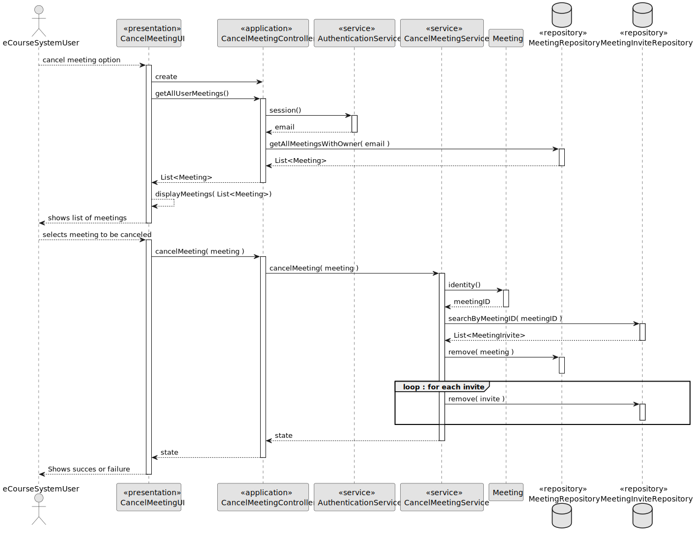
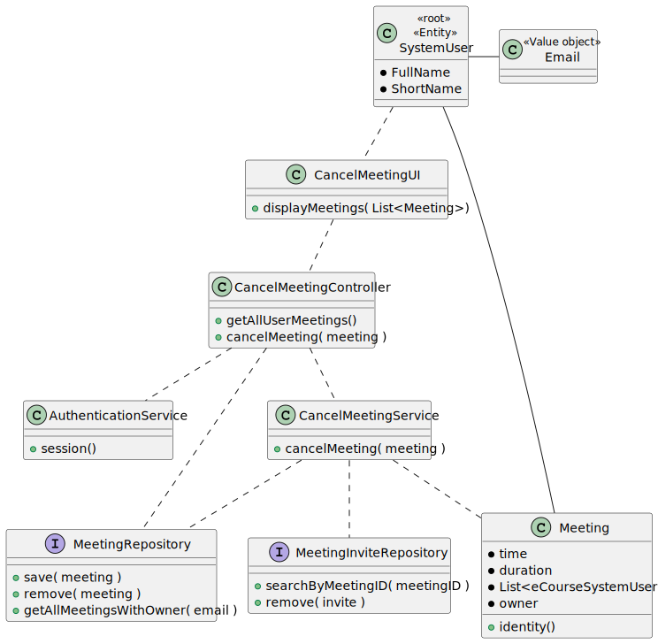

# US 4002

As User, I want to cancel a meeting

## 1. Context

>### **Project Description:**
> **FRM02 Cancel Meeting** A user cancels a meeting that he owns

## 2. Requirements


**US 4003** As User, I want to cancel a meeting

*Regarding this requirement we understand that it relates to all Users and does not have any specific case for a user role. Therefore, we will consider that this requirement it works equally for all user roles.*

## 3. Analysis

>### **Acceptance Criteria:**
> - The user can only cancel a meeting that he owns.
> - The user can´t uncancel a meeting that he owns.

>### **Dependencies:**
> - This US depends on the **US 4001: As a User, I want to schedule a Meeting**, because we cannot cancel a meeting if there is no meetings to be cancelled.


## 4. Design

### 4.1. Realization
#### Sequence Diagram


### 4.2. Class Diagram



### 4.3. Applied Patterns

* **Factory Method:** The `RepositoryFactory` class is used to create objects without specifying the exact class of object that will be created.

* **Service Layer:** The `AuthenticationService` and `CancelMeetingService` classes provide a set of services to the application and encapsulate the application’s business logic.

* **Repository:** The `MeetingRepository` and `MeetingInviteRepository` classes are used to manage the data storage and retrieval for their respective entities.


### 4.4. Tests

**Test 1:** *Verifies that the method cancelMeeting() of the class CancelMeetingService returns true when the meeting is cancelled successfully.*
```
@BeforeAll
static void setUp() {
    MeetingRepository meetingRepo = mock(MeetingRepository.class);
    MeetingInviteRepository meetingInviteRepo = mock(MeetingInviteRepository.class);
    cancelMeetingService = new CancelMeetingService(meetingRepo, meetingInviteRepo);
    ... [ initializing neccessary data for meeting and meetingInvite ] ...
    when(meetingRepo.save(meeting)).thenReturn(meeting);
    when(meetingRepo.ofIdentity(meeting.identity())).thenReturn(Optional.of(meeting) );
    when(meetingInviteRepo.searchByMeetingId( meeting.identity())).thenReturn(List.of( meetingInvite, meetingInvite2));
}
@Test
void testCancelMeetingWithAValidMeeting() {
    assertTrue(cancelMeetingService.cancelMeeting(meeting));
}
````

## 5. Implementation

### Class ManageMeetingController
```
public boolean cancelMeeting(Meeting meeting) {
    return cancelMeetingService.cancelMeeting(meeting);
}
````
### Class CancelMeetingService
```
public boolean cancelMeeting( Meeting meeting ){
    try {
        List<MeetingInvite> invitesToRemove = meetingInviteRepository.searchByMeetingId(meeting.identity());
        for(MeetingInvite invite : invitesToRemove){
            meetingInviteRepository.remove(invite);
        }
        meetingRepository.remove(meeting);
        return true;
    } catch (Exception e) {
        return false;
    }

}
````
### Class JpaMeetingInviteRepository
```
@Override
public List<MeetingInvite> searchByMeetingId(int meetingID) {
    Iterable<MeetingInvite> iterable = findAll();
    List<MeetingInvite> meetingInvites = new ArrayList<>();
    for (MeetingInvite meetingInvite : iterable) {
        if (meetingInvite.meetingID() == meetingID) {
            meetingInvites.add(meetingInvite);
        }
    }
    return meetingInvites;
}
````

## 6. Integration/Demonstration


## 7. Observations

