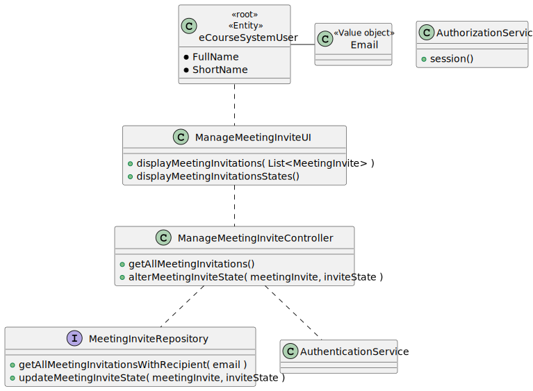

# US 4003

As User, I want to accept or reject a meeting request

## 1. Context


>### **Project Description:**
> **FRM03 Accept/Reject Meeting** A user accepts or rejects an invitation to a meeting.

>### **Client Forum:**
> **Question**:
>Em relação a esta US deveríamos simplesmente considerar os "meeting request" que não foram aceites ou rejeitados?
>Um "meeting request" que já foi aceite ou rejeitado poderá ser alterado, depois?
>
>**Answer**: Não sei se discutiu o assunto na aula OT presencial, mas a intenção nesta US é fazer exactamente o que está descrito: aceitar ou rejeitar um pedido de reunião. A decisão é tomada uma única vez pelo utilizador.

## 2. Requirements


**US 4003** As User, I want to accept or reject a meeting request

*Regarding this requirement we understand that it relates to all Users and does not have any specific case for a user role. Therefore, we will consider that this requirement it works equally for all user roles.*

## 3. Analysis

>### **Acceptance Criteria:**
> - The user can either accept or reject a meeting request.
> - The user can only accept or reject a meeting request once.
> - If the user accepts/rejects a meeting invite, that invite no longer appears in the list that it's showed to the user when selecting option to "Accept/Reject Meeting Invites".

>### **Dependencies:**
> - This US depends on the **US 4001: As a User, I want to schedule a Meeting**, because we cannot accept or reject a meeting if there is no meetings to be accepted or rejected.

## 4. Design

### WatchDog Logic Diagram


### 4.1. Realization
### Sequence Diagram


### 4.2. Class Diagram



### 4.3. Applied Patterns

* **Factory Method:** The `RepositoryFactory` class is used to create objects without specifying the exact class of object that will be created.

* **Service Layer:** The `AuthenticationService` classes provide a set of services to the application and encapsulate the application’s business logic.

* **Repository:** The `MeetingInviteRepository` classes are used to manage the data storage and retrieval for their respective entities.


### 4.4. Tests

**Test:** *Verifies that method ValueOf() works as expected for valid parameters.*
```
@Test
void testMeetingInviteValueOf() {
    MeetingInvite test = MeetingInvite.valueOf(LocalTime.MAX, 20, emailRecipient, emailSender, 1);
    assertTrue(test != null);
    assertEquals(test.meetingID(), 1);
    assertEquals(test.emailContainer().recipientEmail(), emailRecipient);
}
````
**Test:** *Verifies that it isn´t possible to create a meeting invite with nullable variables.*
````
@Test
void testMeetingInviteValueOfWithNulls() {
    assertThrows(IllegalArgumentException.class, () -> MeetingInvite.valueOf(null, 1, null, null, 1));
}
````
**Test:** *Verifies that method equals works as expected.*
````
@Test
void testMeetingInviteEquals() {
    MeetingInvite test = MeetingInvite.valueOf(LocalTime.MAX, 20, emailRecipient, emailSender, 1);
    MeetingInvite test2 = MeetingInvite.valueOf(LocalTime.MAX, 20, emailRecipient, emailSender, 1);
    MeetingInvite test3 = MeetingInvite.valueOf(LocalTime.MIN, 20, emailRecipient, emailSender, 2);

    assertTrue(test.equals(test2));
    assertFalse(test.equals(test3));
}
````


## 5. Implementation

### - Class ManageMeetingInviteController
````
public List<MeetingInvite> getAllMeetingInvitations(){
    EmailAddress email = authz.session().get().authenticatedUser().email();
    return invitesRepo.getAllMeetingInvitationsWithRecipient(email);
}

public boolean alterMeetingInviteState(MeetingInvite meetingInvite, MeetingInviteState inviteState ){
    return invitesRepo.updateMeetingInviteState(meetingInvite, inviteState) != null;
}
````

### - Class JpaMeetingInviteRepository
````
@Override
public List<MeetingInvite> getAllMeetingInvitationsWithRecipient(EmailAddress email) {
    Iterable<MeetingInvite> iterable = findAll();
    List<MeetingInvite> meetingInvites = new ArrayList<>();
    for (MeetingInvite meetingInvite : iterable) {
        if (meetingInvite.emailContainer().recipientEmail().equals(email.toString()) && meetingInvite.state() == MeetingInviteState.PENDING ) {
            meetingInvites.add(meetingInvite);
        }
    }
    return meetingInvites;
}
````

## 6. Integration/Demonstration


## 7. Observations

