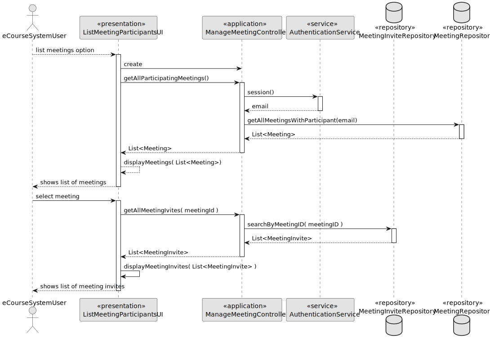
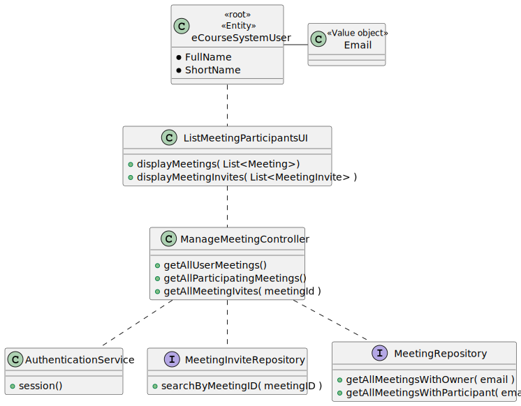

# US 4004

As User, I want to view a list of participants in my meeting and their status (accept or reject)

## 1. Context


>### **Project Description:**
> **FRM04 List Participants** The system displays the lists of participants in a meeting and
the response status (accept or reject meeting)

>### **Client Forum:**
> **Question**: Relativamente a esta user story, o ficheiro excel providenciado refere o seguinte:
> As User, I want to view a list of participants in my meeting and their status (accept or reject).
>
>Aqui, pelo menos a meu ver, o termo "my meeting" parece sugerir que esta funcionaliade apenas se a aplica a meetings que o utilizador criou (i.e. se um User não for owner de uma meeting não puderá ver os seus participantes).
>
>No entanto, no documento de especificação, o seguinte é dito:
>
> The system displays the lists of participants in a meeting and the response status (accept or reject meeting).
> O que não discrimina se esta funcionalidade deve estar disponível a todos os participantes ou apenas ao criador.
>
>A meu ver, a alternativa que parece fazer mais sentido seria, de facto, qualquer utilizador poder ver a lista de participantes de uma meeting, desde que pertença à mesma; no entanto, faço-lhe esta pergunta para me certificar de que a feature que vai ser implementada realmente corresponde àquilo que o cliente pretende.
>
>Aproveito ainda para lhe perguntar se a data da ocorrência da meeting possui alguma importância no que diz respeito a este caso de uso; isto é, o utilizador deve poder selecionar a meeting que pretende ver os participantes mesmo que esta já tenha ocorrido (e terminado), ou apenas aquelas que estão/irão decorrer é que possuem relevância?
>
>**Answer**: Relativamente à primeira questão faz sentido a sua segunda interpretação, ou seja, o que está no documento de especificação está correto e reflete o que o cliente deseja. Ou seja, deve ser possível qualquer utilizador participante consultar os outros participantes em reuniões na qual ele também é participante.
>
>Relativamente à segunda questão, do ponto de vista do cliente faz sentido também ver reuniões que ocorreram no passado.


## 2. Requirements


**US 4003** As User, I want to view a list of participants in my meeting and their status (accept or reject)

*Regarding this requirement we understand that it relates to all Users and does not have any specific case for a user role. Therefore, we will consider that this requirement it works equally for all user roles.*

## 3. Analysis

>### **Acceptance Criteria:**
> - The system displays the lists of participants in a meeting and the response status (ACCEPTED/REJECTED/PENDING).
> - The system must display meetings that have already occurred and meetings that will occur in the future.
> - The system must display the list of participants to all users involved in the meeting.

>### **Dependencies:**
> - This US depends on the **US 4001: As a User, I want to schedule a Meeting**, because we cannot list participants if there is no meeting.
> - This US depends on the **US 4003: As a User, I want to accept or reject a Meeting invitation**, because it changes the status of the invitations of the participants. 
> Therefore, the output of this US changes everytime a participant accepts/rejects an invitation.

## 4. Design


### 4.1. Realization
#### Sequence Diagram


### 4.2. Class Diagram



### 4.3. Applied Patterns

* **Factory Method:** The `RepositoryFactory` class is used to create objects without specifying the exact class of object that will be created.

* **Service Layer:** The `AuthenticationService` classes provide a set of services to the application and encapsulate the application’s business logic.

* **Repository:** The `MeetingInviteRepository` and `MeetingRepository` classes are used to manage the data storage and retrieval for their respective entities.


### 4.4. Tests

**Test 1:** *Verifies that the meetingDuration() method of class Meeting works as expected.*
```
@Test
void testMeetingDurationMethod() {
    Meeting meeting = new Meeting(LocalTime.MAX, 60, emailSender);
    assertEquals(60, meeting.meetingDuration());
}
````
**Test 2:** *Verifies that the meetingTime() method of class Meeting works as expected.*
````
@Test
void testMeetingTimeMethod() {
    Meeting meeting = new Meeting(LocalTime.MAX, 60, emailSender);
    assertEquals(LocalTime.MAX, meeting.meetingTime());
}
````
**Test 3:** *Verifies that the meetingOwner() method of class Meeting works as expected.*
````
@Test
void testMeetingOwnerMethod() {
    Meeting meeting = new Meeting(LocalTime.MAX, 60, emailSender);
    assertEquals(emailSender, meeting.meetingOwner());
}
````
**Test 4:** *Verifies that the meetingParticipants() method of class Meeting works as expected.*
````
@Test
void testMeetingParticipantsMethod() {
    Meeting meeting = new Meeting(LocalTime.MAX, 60, participants, emailSender);

    assertEquals(2, meeting.meetingParticipants().size());
    assertArrayEquals(participants.toArray(), meeting.meetingParticipants().toArray());
}
````
**Test 5:** *Verifies that the equals() method of class Meeting works as expected.*
````
@Test
void testMeetingEquals() {
    Meeting meeting = new Meeting(LocalTime.MAX, 60, emailSender);
    Meeting meeting2 = new Meeting(LocalTime.MAX, 60, emailSender);
    Meeting meeting3 = new Meeting(LocalTime.MAX, 60, participants, emailSender);

    assertTrue(meeting.equals(meeting2));
    assertFalse(meeting.equals(meeting3));
}
````

## 5. Implementation
### Class ManageMeetingController
````
public List<Meeting> getAllParticipatingMeetings() {
    EmailAddress email = authz.session().get().authenticatedUser().email();
    return meetingRepository.getAllMeetingsWithParticipant(email);
}

public List<MeetingInvite> getAllMeetingInvitations(int meetingID) {
   return meetingInviteRepository.searchByMeetingId(meetingID);
}
````
### Class JpaMeetingRepository
````
@Override
public List<Meeting> getAllMeetingsWithParticipant(EmailAddress email){
    Iterable<Meeting> iterable = findAll();
    List<Meeting> meetings = new ArrayList<>();
    for (Meeting meeting : iterable) {
        if (meeting.meetingOwner().eCourseUserEmail().equals(email)) {
            meetings.add(meeting);
            continue;
        }
        for (eCourseSystemUser user : meeting.meetingParticipants()) {
            if (user.eCourseUserEmail().equals(email)) {
                meetings.add(meeting);
                break;
            }
        }
    }
    return meetings;
}
````
### Class JpaMeetingInviteRepository
````
@Override
public List<MeetingInvite> searchByMeetingId(int meetingID) {
    Iterable<MeetingInvite> iterable = findAll();
    List<MeetingInvite> meetingInvites = new ArrayList<>();
    for (MeetingInvite meetingInvite : iterable) {
        if (meetingInvite.meetingID() == meetingID) {
            meetingInvites.add(meetingInvite);
        }
    }
    return meetingInvites;

}
````
## 6. Integration/Demonstration


## 7. Observations

